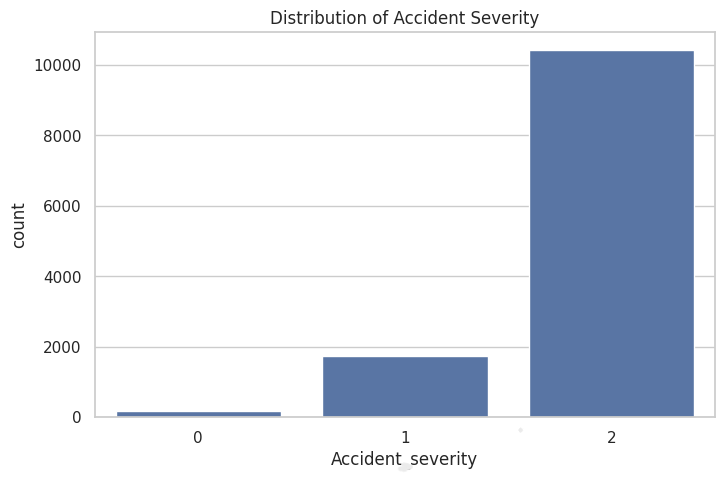
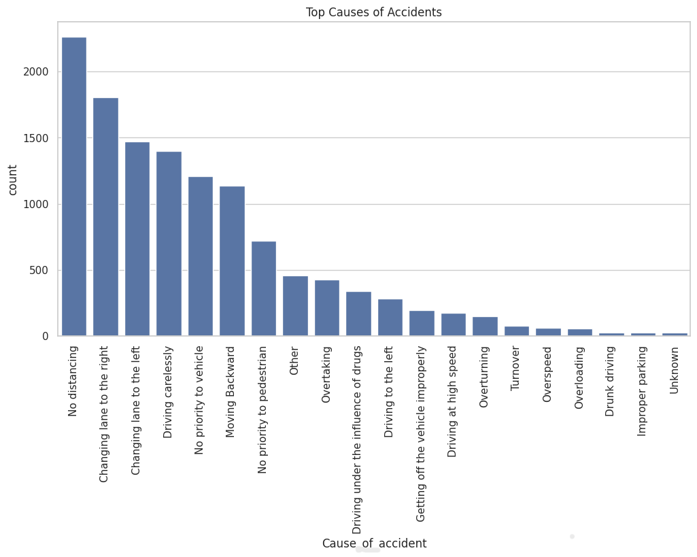
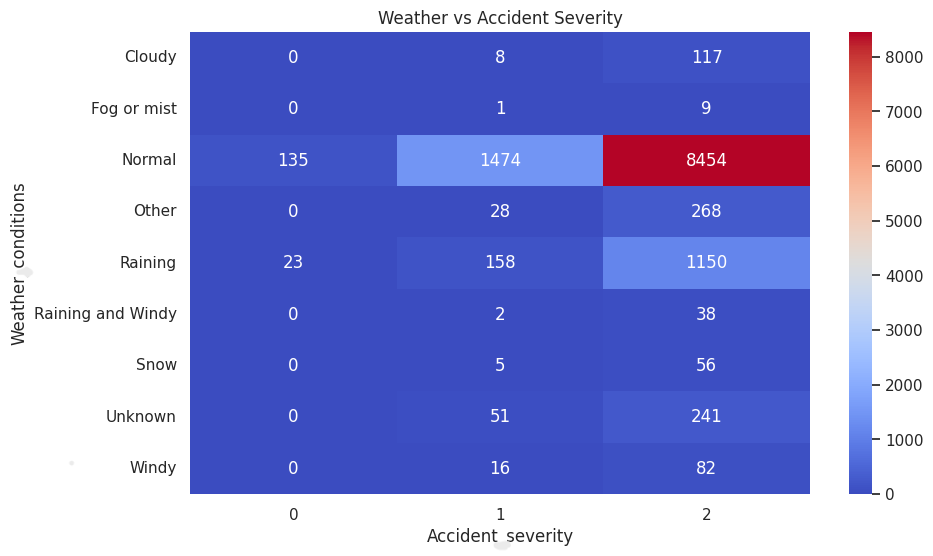
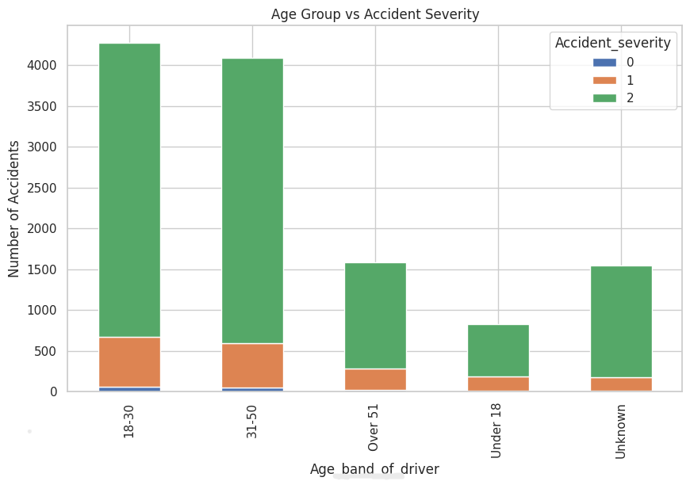

# 🚗 Traffic Accident Risk Analysis

This project analyzes road accident data to uncover patterns, identify risk factors, and predict accident severity using machine learning. By examining historical accident records, this analysis aims to provide data-driven insights to improve road safety and mitigate future risks.

## 🎯 Objectives
- **Analyze accident trends** based on driver demographics, environmental conditions, and road characteristics.
- **Identify major causes** contributing to high-frequency accident zones.
- **Build a predictive model** to accurately forecast accident severity.
- **Provide actionable safety recommendations** for city planners and traffic authorities.

## 🧠 Technologies Used
| Category | Tools |
| :--- | :--- |
| **Language** | Python |
| **Data Manipulation** | Pandas, NumPy |
| **Data Visualization** | Seaborn, Matplotlib |
| **Machine Learning** | Scikit-learn |

## 📊 Key Insights
* **Human Factors First:** Driver behavior and human errors are the leading causes of accidents.
* **Environmental Impact:** Poor lighting and adverse weather conditions significantly increase the severity of an accident.
* **Driver Experience:** Less experienced drivers show a higher propensity for being involved in severe accidents.
* **Infrastructure Risks:** Certain junction types and intersection designs operate as high-risk zones.

## 🤖 Machine Learning Model
> **Model Used:** Random Forest Classifier  
> **Accuracy:** **1.0**

The Random Forest model was chosen for its robustness in handling tabular data and its ability to rank feature importance, giving us direct insight into what variables impact accident severity the most.

## 📸 Visualizations

### 1. Accident Severity Distribution

### 2. Top Causes of Accidents

### 3. Weather vs Severity Heatmap

### 4. Age Group vs Accident Severity

## 🚨 Recommendations
1. **Improve Road Lighting:** Upgrade illumination on high-risk, accident-prone streets.
2. **Increase Driver Awareness:** Implement targeted educational programs focusing on inexperienced drivers.
3. **Enhance Road Design:** Redesign critical junctions and add better signage or traffic control measures.
4. **Target High-Risk Behaviors:** Increase enforcement and awareness campaigns around speeding and distracted driving.

## 🚀 Future Improvements
1. Deploy as a web dashboard
2. Real-time accident prediction
3. Integration with traffic systems